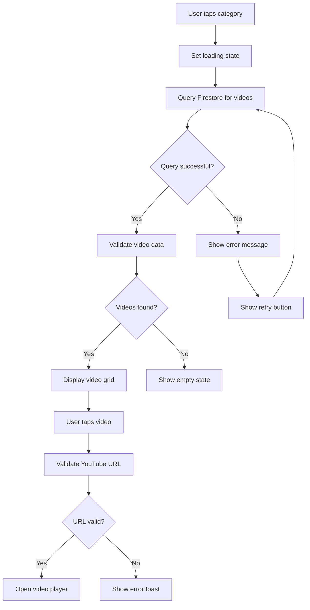

# Design Document

## Overview

The cyberbullying video loading issue stems from potential problems in the video fetching logic, error handling, and state management within the VideoController. The design focuses on improving the robustness of video loading, implementing proper error handling, and ensuring consistent behavior across all video categories.

## Architecture

The current architecture follows a standard Flutter pattern:
- **VideoPage**: Stateful widget that hosts the VideoController
- **VideoController**: Manages category fetching, category selection, and video list display
- **VideoPlayerPage**: Handles individual video playback using YouTube player
- **Firebase Firestore**: Backend storage for video metadata

The issue likely occurs in the video fetching logic within the `buildVideoList` method of VideoController.

## Components and Interfaces

### Enhanced VideoController

**Current Issues Identified:**
1. Potential infinite loading when Firestore query fails silently
2. Missing error boundaries for network failures
3. Inconsistent state management between category and video views
4. No timeout handling for slow network connections

**Design Improvements:**

#### State Management Enhancement
```dart
enum VideoLoadingState {
  loading,
  loaded,
  error,
  empty
}

class VideoControllerState {
  final List<List<String>>? categories;
  final String? selectedCategory;
  final VideoLoadingState loadingState;
  final String? errorMessage;
  final List<QueryDocumentSnapshot>? videos;
}
```

#### Error Handling Strategy
- Implement try-catch blocks around all Firestore operations
- Add timeout handling (10 seconds for category fetch, 15 seconds for video fetch)
- Provide user-friendly error messages
- Add retry mechanisms for failed operations

#### Video Validation Logic
- Validate video URLs before displaying them
- Check for required fields (videoUrl, title, thumbnailUrl)
- Handle missing or malformed data gracefully

### Enhanced Video Loading Flow



## Data Models

### Video Data Structure
```dart
class VideoData {
  final String id;
  final String title;
  final String videoUrl;
  final String thumbnailUrl;
  final String category;
  final String? description;
  
  bool get isValid => 
    title.isNotEmpty && 
    videoUrl.isNotEmpty && 
    thumbnailUrl.isNotEmpty &&
    category.isNotEmpty;
}
```

### Category Data Structure
```dart
class CategoryData {
  final String name;
  final String thumbnail;
  
  bool get isValid => name.isNotEmpty && thumbnail.isNotEmpty;
}
```

## Error Handling

### Error Types and Responses

1. **Network Connectivity Issues**
   - Display: "Please check your internet connection"
   - Action: Retry button available

2. **Firestore Query Failures**
   - Display: "Unable to load videos. Please try again."
   - Action: Automatic retry after 3 seconds, manual retry button

3. **Empty Category Results**
   - Display: "No videos available in this category"
   - Action: Back to categories button

4. **Invalid Video URLs**
   - Display: Toast message "This video is currently unavailable"
   - Action: Skip to next video or return to list

5. **YouTube Player Initialization Failures**
   - Display: "Unable to play this video"
   - Action: Return to video list

### Timeout Handling
- Category fetch: 10 second timeout
- Video list fetch: 15 second timeout
- Video player initialization: 8 second timeout

## Testing Strategy

### Unit Tests
- Test video data validation logic
- Test error handling for various failure scenarios
- Test state transitions in VideoController

### Integration Tests
- Test Firestore query operations
- Test navigation between categories and video lists
- Test video player initialization with various URL formats

### Manual Testing Scenarios
1. Test with poor network connectivity
2. Test with invalid video URLs in Firestore
3. Test with empty categories
4. Test rapid category switching
5. Test back navigation functionality

## Implementation Approach

### Phase 1: Error Handling Enhancement
- Add comprehensive try-catch blocks
- Implement timeout handling
- Add loading state management
- Create user-friendly error messages

### Phase 2: Data Validation
- Implement video data validation
- Add URL format checking
- Handle missing or malformed data

### Phase 3: UI/UX Improvements
- Add retry mechanisms
- Implement proper loading indicators
- Add empty state handling
- Improve navigation flow

### Phase 4: Testing and Validation
- Add error simulation for testing
- Implement logging for debugging
- Test with various network conditions
- Validate fix across all video categories

## Performance Considerations

- Implement video thumbnail caching
- Add pagination for large video lists
- Optimize Firestore queries with proper indexing
- Lazy load video player controllers
- Implement proper widget disposal to prevent memory leaks