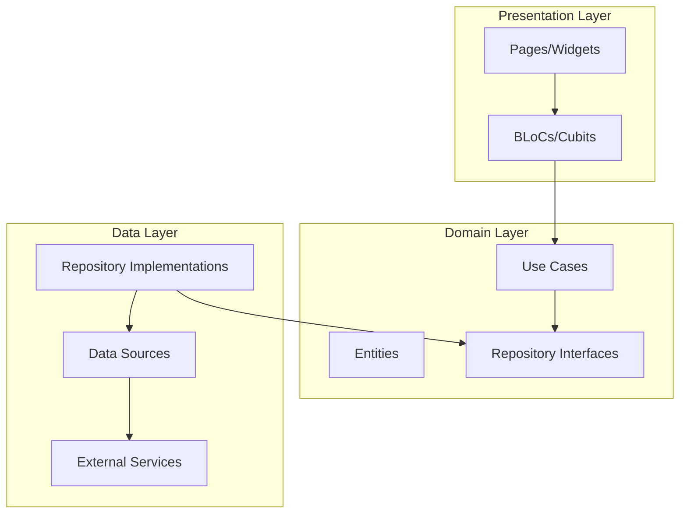
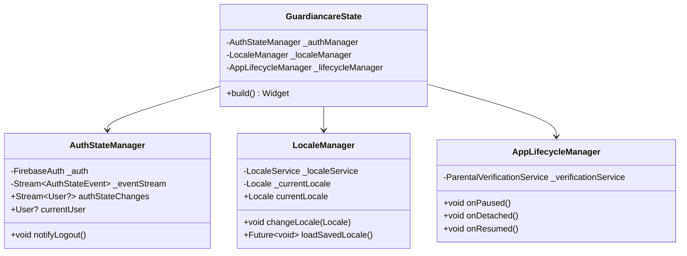
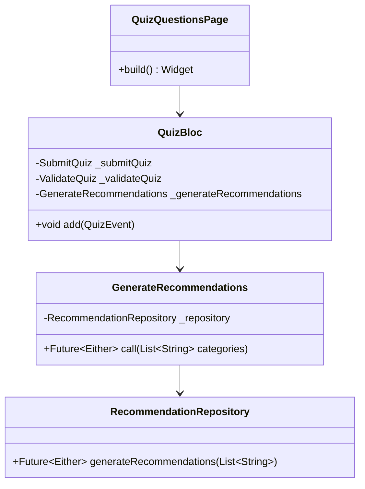
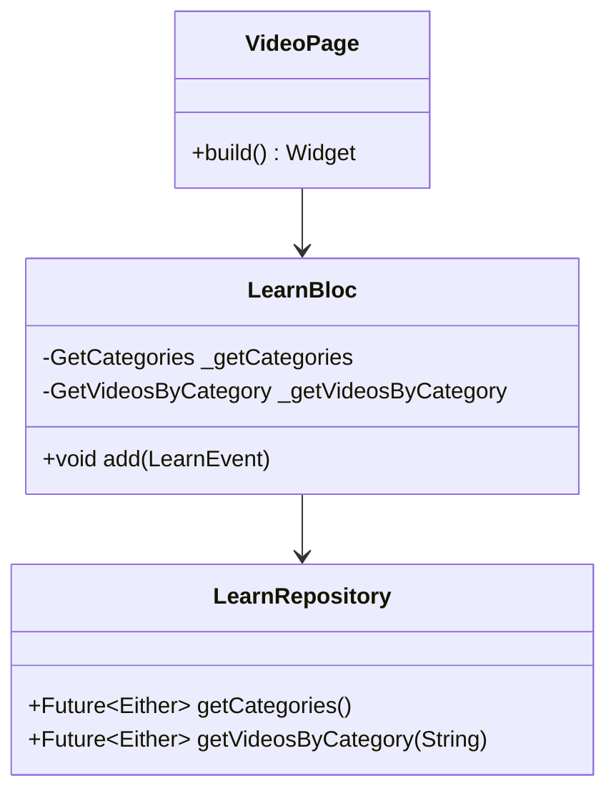
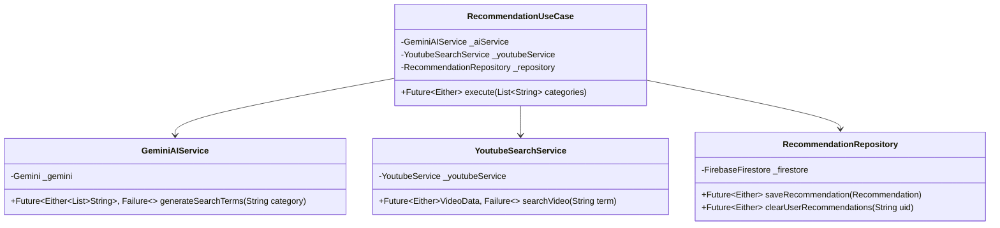
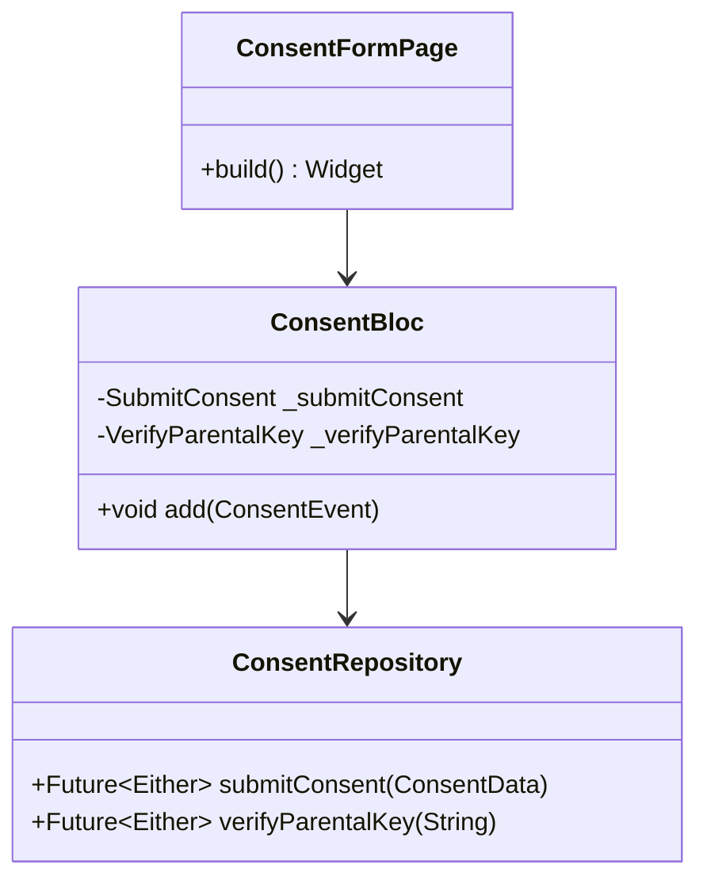
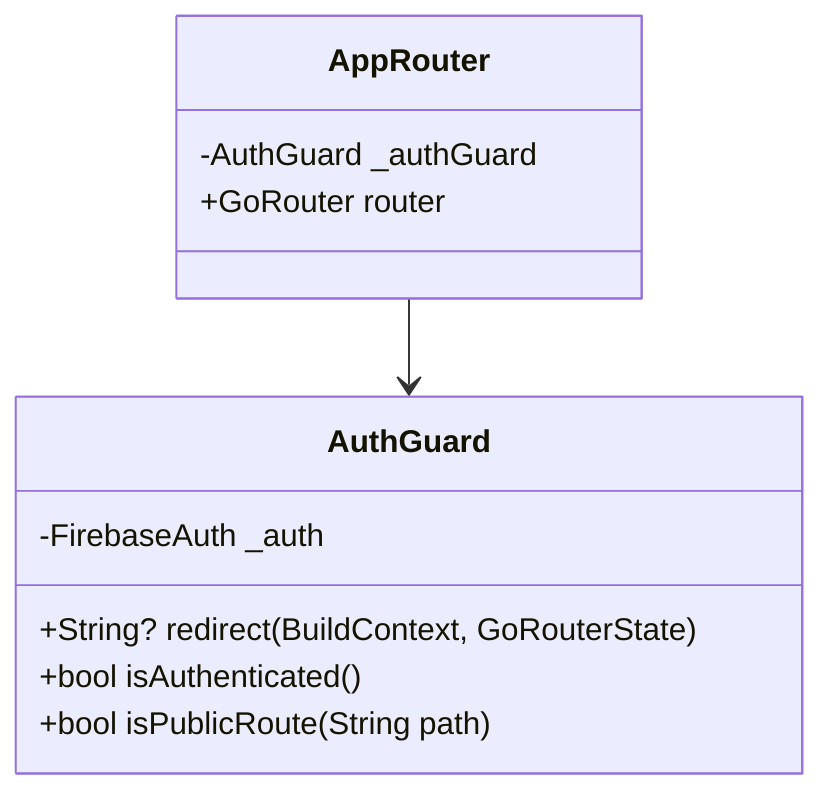
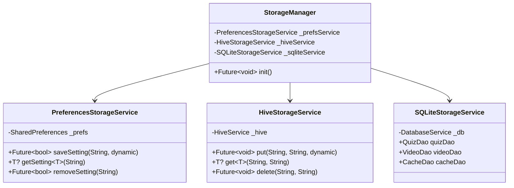
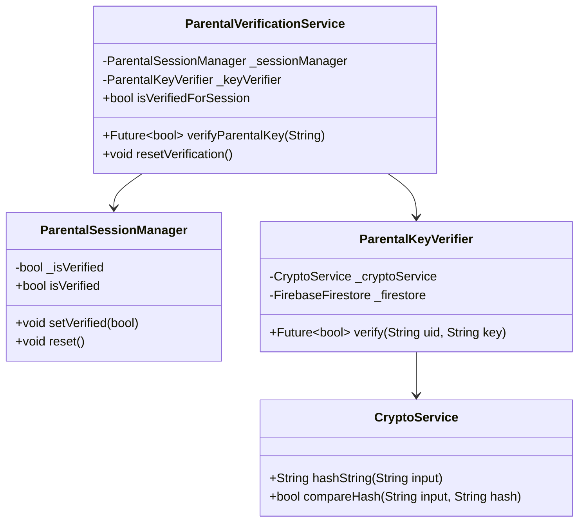

# Design Document: SRP Clean Architecture Fix

## Overview

This design addresses Single Responsibility Principle (SRP) violations in the GuardianCare Flutter application. The refactoring follows Clean Architecture principles, ensuring each class has exactly one reason to change. The design introduces dedicated managers, services, and use cases to properly separate concerns across presentation, domain, and data layers.

## Architecture

The refactored architecture follows the standard Clean Architecture pattern with clear boundaries:



### Key Architectural Changes

1. **State Management Separation**: Extract auth, locale, and lifecycle management from main app state
2. **Business Logic Extraction**: Move business logic from pages to BLoCs and Use Cases
3. **Service Decomposition**: Split monolithic services into focused, single-responsibility services
4. **Widget Extraction**: Extract complex UI building logic into dedicated widgets

## Components and Interfaces

### 1. Main App State Decomposition



#### Interfaces

```dart
/// Manages authentication state and notifies dependent services
abstract class AuthStateManager {
  Stream<User?> get authStateChanges;
  User? get currentUser;
  void notifyLogout();
  void dispose();
}

/// Manages application locale
abstract class LocaleManager {
  Locale get currentLocale;
  void changeLocale(Locale newLocale);
  Future<void> loadSavedLocale();
}

/// Manages app lifecycle events
abstract class AppLifecycleManager {
  void onPaused();
  void onDetached();
  void onResumed();
}
```

### 2. Quiz Business Logic Extraction



#### New Events and States

```dart
// New Quiz Events
abstract class QuizEvent {}
class SubmitAnswerRequested extends QuizEvent {
  final int questionIndex;
  final int selectedOption;
}
class CompleteQuizRequested extends QuizEvent {
  final List<Map<String, dynamic>> questions;
  final int correctAnswers;
}

// New Quiz States
abstract class QuizState {}
class QuizAnswerValidated extends QuizState {
  final bool isCorrect;
  final int correctIndex;
}
class QuizCompleted extends QuizState {
  final int score;
  final int total;
}
class RecommendationsGenerating extends QuizState {}
class RecommendationsGenerated extends QuizState {}
```

### 3. Video/Learn Business Logic Extraction

The VideoPage currently contains direct Firestore queries. This will be refactored to use the existing LearnBloc.



### 4. RecommendationService Decomposition



#### Interfaces

```dart
/// Handles Gemini AI interactions exclusively
abstract class GeminiAIService {
  Future<Either<Failure, List<String>>> generateSearchTerms(String category);
}

/// Handles YouTube API interactions exclusively
abstract class YoutubeSearchService {
  Future<Either<Failure, VideoData>> searchVideo(String term);
}

/// Handles recommendation persistence exclusively
abstract class RecommendationRepository {
  Future<Either<Failure, void>> saveRecommendation(Recommendation recommendation);
  Future<Either<Failure, void>> clearUserRecommendations(String uid);
  Future<Either<Failure, List<Recommendation>>> getUserRecommendations(String uid);
}
```

### 5. Consent Form Business Logic Separation



### 6. Account Page Responsibilities Separation

The AccountPage currently handles language changes, logout, and account deletion directly. These will be delegated through ProfileBloc.

```dart
// New Profile Events
class ChangeLanguageRequested extends ProfileEvent {
  final Locale newLocale;
}

class LogoutRequested extends ProfileEvent {}

// ProfileBloc will delegate to appropriate services
class ProfileBloc {
  final LocaleService _localeService;
  final AuthRepository _authRepository;
  final DeleteAccount _deleteAccount;
  // ...
}
```

### 7. Authentication Guard Extraction



#### Interface

```dart
/// Encapsulates all authentication redirect logic
abstract class AuthGuard {
  String? redirect(BuildContext context, GoRouterState state);
  bool isAuthenticated();
  bool isPublicRoute(String path);
}
```

### 8. StorageManager Decomposition



### 9. ParentalVerificationService Decomposition



### 10. UI Widget Extraction

#### EmergencyContactCard Widget

```dart
class EmergencyContactCard extends StatelessWidget {
  final IconData icon;
  final String title;
  final List<EmergencyContact> contacts;
  final void Function(String number) onCall;
  
  @override
  Widget build(BuildContext context) {
    // Card rendering logic extracted from EmergencyContactPage
  }
}
```

#### TermsAndConditionsDialog Widget

```dart
class TermsAndConditionsDialog extends StatelessWidget {
  final VoidCallback onAccept;
  final VoidCallback onDecline;
  
  static Future<bool?> show(BuildContext context) {
    // Dialog rendering logic extracted from LoginPage
  }
}
```

## Data Models

### Recommendation Entity

```dart
class Recommendation {
  final String id;
  final String title;
  final String videoUrl;
  final String category;
  final String thumbnailUrl;
  final DateTime timestamp;
  final String userId;
}
```

### VideoData Entity

```dart
class VideoData {
  final String videoId;
  final String title;
  final String thumbnailUrl;
  final String videoUrl;
}
```

### AuthStateEvent

```dart
enum AuthStateEventType { login, logout, sessionExpired }

class AuthStateEvent {
  final AuthStateEventType type;
  final User? user;
}
```

## Correctness Properties

*A property is a characteristic or behavior that should hold true across all valid executions of a system-essentially, a formal statement about what the system should do. Properties serve as the bridge between human-readable specifications and machine-verifiable correctness guarantees.*

### Property 1: Main App State Delegation
*For any* authentication state change, locale change, or lifecycle event in the application, the GuardiancareState SHALL delegate handling to the appropriate manager (AuthStateManager, LocaleManager, or AppLifecycleManager) rather than handling it directly.
**Validates: Requirements 1.1, 1.2, 1.3, 1.4**

### Property 2: Quiz Business Logic Delegation
*For any* quiz answer submission, quiz completion, or recommendation generation request, the QuizQuestionsPage SHALL dispatch events to QuizBloc, and the QuizBloc SHALL handle all business logic including validation, scoring, and repository coordination.
**Validates: Requirements 2.1, 2.2, 2.3**

### Property 3: Learn Business Logic Delegation
*For any* video category request or video list request, the VideoPage SHALL dispatch events to LearnBloc, and the LearnBloc SHALL fetch data through LearnRepository without direct Firestore access in the page.
**Validates: Requirements 3.1, 3.2**

### Property 4: Recommendation Service Decomposition
*For any* recommendation generation request, the GeminiAIService SHALL handle only Gemini API interactions, the YoutubeSearchService SHALL handle only YouTube API interactions, and the RecommendationRepository SHALL handle only Firestore persistence operations.
**Validates: Requirements 4.1, 4.2, 4.3, 4.5**

### Property 5: Consent Business Logic Delegation
*For any* parental key submission or validation request, the ConsentFormPage SHALL dispatch events to ConsentBloc, and the ConsentBloc SHALL handle validation logic and delegate persistence to ConsentRepository.
**Validates: Requirements 5.1, 5.2**

### Property 6: Profile Business Logic Delegation
*For any* language change, account deletion, or logout request from AccountPage, the ProfileBloc SHALL delegate to the appropriate service (LocaleService, AccountDeletionUseCase, or AuthRepository).
**Validates: Requirements 6.1, 6.2, 6.3**

### Property 7: Auth Guard Encapsulation
*For any* route redirect evaluation in AppRouter, the authentication check logic SHALL be encapsulated in AuthGuard, and AppRouter SHALL only define route configurations.
**Validates: Requirements 7.1, 7.2**

### Property 8: Storage Service Separation
*For any* storage operation, SharedPreferences operations SHALL be handled exclusively by PreferencesStorageService, Hive operations SHALL be handled exclusively by HiveStorageService, and SQLite operations SHALL be handled exclusively by SQLiteStorageService.
**Validates: Requirements 8.1, 8.2, 8.3**

### Property 9: Parental Verification Decomposition
*For any* parental verification operation, session state SHALL be managed exclusively by ParentalSessionManager, key verification logic SHALL be handled exclusively by ParentalKeyVerifier, and cryptographic operations SHALL be handled exclusively by CryptoService.
**Validates: Requirements 9.1, 9.2, 9.3**

## Error Handling

### Service-Level Error Handling

Each decomposed service will return `Either<Failure, T>` to handle errors:

```dart
abstract class Failure {
  final String message;
  const Failure(this.message);
}

class GeminiApiFailure extends Failure {
  const GeminiApiFailure(String message) : super(message);
}

class YoutubeApiFailure extends Failure {
  const YoutubeApiFailure(String message) : super(message);
}

class StorageFailure extends Failure {
  const StorageFailure(String message) : super(message);
}

class AuthenticationFailure extends Failure {
  const AuthenticationFailure(String message) : super(message);
}
```

### BLoC Error States

Each BLoC will emit appropriate error states:

```dart
class QuizError extends QuizState {
  final String message;
}

class LearnError extends LearnState {
  final String message;
}

class ProfileError extends ProfileState {
  final String message;
}
```

## Testing Strategy

### Unit Tests

Unit tests will verify specific examples and edge cases:

1. **Manager Tests**: Test AuthStateManager, LocaleManager, AppLifecycleManager initialization and delegation
2. **Service Tests**: Test GeminiAIService, YoutubeSearchService, CryptoService in isolation
3. **Repository Tests**: Test RecommendationRepository CRUD operations
4. **BLoC Tests**: Test event handling and state transitions
5. **Widget Tests**: Test EmergencyContactCard and TermsAndConditionsDialog rendering

### Property-Based Tests

Property-based tests will verify universal properties using the `fast_check` package for Dart:

1. **Delegation Properties**: Verify that for any input, the correct manager/service is invoked
2. **Separation Properties**: Verify that services don't cross boundaries
3. **State Management Properties**: Verify that state changes propagate correctly

### Test Configuration

- Minimum 100 iterations per property test
- Each property test references its design document property
- Tag format: **Feature: srp-clean-architecture-fix, Property {number}: {property_text}**

### Integration Tests

Integration tests will verify end-to-end flows:

1. Quiz completion → Recommendation generation flow
2. Login → Auth state propagation flow
3. Locale change → App restart flow
