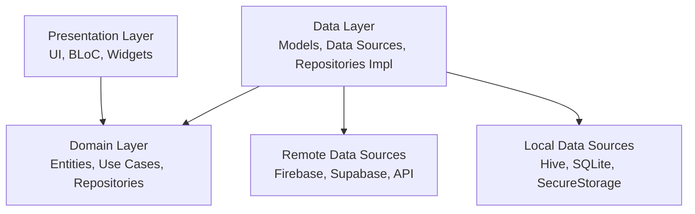

# 🏥 GuardianCare - Flutter Application

[](https://flutter.dev)
[](https://dart.dev)
[](LICENSE)
[]()
[](https://blog.cleancoder.com/uncle-bob/2012/08/13/the-clean-architecture.html)

A comprehensive educational and support application for guardians and children, engineered with **Clean Architecture** principles for scalability, testability, and maintainability.

---

## 📋 Table of Contents

- [Overview](#-project-overview)
- [Architecture](#-architecture)
- [Tech Stack](#-tech-stack)
- [Project Structure](#-project-structure)
- [Getting Started](#-getting-started)
- [Environment Configuration](#-environment-configuration)
- [Security](#-security)
- [Build & Run](#-build--run)
- [Current Status](#-current-status)
- [Roadmap](#-roadmap)
- [Contributing](#-contributing)
- [Screenshots](#-screenshots-of-application-apk)
- [License](#-license)

---

## 📋 Project Overview

GuardianCare is a production-grade Flutter application designed to provide educational resources, community support, and safety features for guardians and children. The application has been meticulously refactored to follow Clean Architecture principles, ensuring a separation of concerns that facilitates independent testing and feature expansion.

---

## 🏗️ Architecture

This project follows **Clean Architecture** with three distinct, loosely coupled layers:



### Key Principles
- **Dependency Rule**: Source code dependencies only point inwards. The Domain layer is independent of framework, UI, and external agencies.
- **Single Responsibility**: Each class has one job and one reason to change.
- **Dependency Inversion**: High-level modules do not depend on low-level modules; both depend on abstractions.
- **Testability**: The business logic can be tested without UI, Database, or Web Server.

---

## 🛠️ Tech Stack

### Core
- **Flutter**: UI Toolkit (SDK >=3.4.0 <4.0.0)
- **Dart**: Programming Language
- **Clean Architecture**: Structural Pattern

### State Management
- **flutter_bloc**: Predictable state management (BLoC pattern)
- **equatable**: Value equality for efficient state comparison

### Backend & Data
- **Firebase**: (Auth, Firestore, Crashlytics, Analytics)
- **Supabase**: (Alternative Backend support via polymorphism)
- **Hive**: Lightweight local NoSQL database
- **sqflite**: SQLite plugin for Flutter

### Navigation
- **go_router**: Declarative routing package

### Dependency Injection
- **get_it**: Service Locator
- **injectable**: Code generation for DI

### Testing
- **mockito**: Mocking framework
- **bloc_test**: Testing library for BLoC
- **fake_cloud_firestore**: In-memory Cloud Firestore for testing

---

## 📂 Project Structure

```
lib/
├── core/                       # Core functionality & Shared Kernel
│   ├── config/                 # Environment & Config
│   ├── error/                  # Error handling (Failures, Exceptions)
│   ├── usecases/               # Base UseCase definitions
│   ├── util/                   # Utilities (Logger, Validators)
│   └── di/                     # Dependency Injection setup
│
├── features/                   # Feature-based modular structure
│   ├── authentication/         # ✅ Admin & User Auth
│   │   ├── domain/             # Entities, Repositories, UseCases
│   │   ├── data/               # Models, DataSources, Repo Impl
│   │   └── presentation/       # BLoC, Pages, Widgets
│   │
│   ├── forum/                  # ✅ Community Forum
│   │   ├── domain/
│   │   ├── data/
│   │   └── presentation/
│   │
│   └── [other features]/       # ⏳ Home, Profile, Learning, etc.
│
└── main.dart                   # Application Entry Point
```

---

## 🚀 Getting Started

### Prerequisites

Ensure you have the following installed:
- **Flutter SDK**: `3.x` (Stable channel)
- **Dart SDK**: Compatible with Flutter version
- **Git**: Version control
- **Android Studio / VS Code**: Recommended IDEs with Flutter/Dart plugins

### Installation

1. **Clone the repository**
   ```bash
   git clone <repository-url>
   cd guardiancare
   ```

2. **Install dependencies**
   ```bash
   flutter clean
   flutter pub get
   ```

3. **Code Generation (if applicable)**
   Since we use `injectable` and `json_serializable`, run build runner:
   ```bash
   dart run build_runner build --delete-conflicting-outputs
   ```

---

## 🌍 Environment Configuration

This project uses **Environment Variables** to manage sensitive keys and configuration.

### 1. `.env` Setup
Create a `.env` file in the root directory. **Do NOT commit this file**.
Use `.env.example` as a template:

```ini
# .env
API_URL=https://api.example.com
SUPABASE_URL=your_supabase_url
SUPABASE_ANON_KEY=your_supabase_anon_key
# Add other secrets here (exclude references to hardcoded keys in code)
```

### 2. Firebase Configuration
- Place `google-services.json` in `android/app/`.
- Place `GoogleService-Info.plist` in `ios/Runner/`.
- Ensure `firebase_options.dart` is present in `lib/` (generated via `flutterfire configure`).

---

## 🔒 Security

We adhere to strict security practices:
- **No Credentials in Git**: `.env` files and Firebase keys are git-ignored.
- **Secure Logging**: Usage of `Log` utility instead of `print` or `debugPrint`. Logging is stripped in Release builds.
- **Secure Storage**: Sensitive local data is encrypted.
- **Environment Isolation**: Distinct configurations for Development, Staging, and Production.

---

## 🛠️ Build & Run

### Debug Mode
Run on an emulator or connected device:
```bash
flutter run
# OR with a specific flavor (if configured)
flutter run --flavor dev
```

### Production Build
Generate release artifacts:

**Android (APK):**
```bash
flutter build apk --release
```

**Android (App Bundle):**
```bash
flutter build appbundle --release
```

**iOS (IPA):**
```bash
flutter build ios --release
```

**Obfuscation (Optional but Recommended):**
```bash
flutter build apk --obfuscate --split-debug-info=/<project-name>/<directory>
```

---

## 📊 Current Status

| Module | Status | Notes |
| :--- | :---: | :--- |
| **Authentication** | ✅ Stable | Email, Google OAuth, Persistence |
| **Forum** | ✅ Stable | Real-time updates, Categorization |
| **Home Dashboard** | ⚠️ In Progress | UI Skeleton ready |
| **Learning** | ⚠️ In Progress | Content integration pending |
| **Quizzes** | ⚠️ In Progress | Logic refinement needed |
| **Emergency** | ⏳ Planned | Contacts & SOS integration |
| **Profile** | ⏳ Planned | User management |

---

## 🤝 Contributing

We welcome contributions! Please follow these guidelines to ensure quality.

### Workflow
1. **Fork** the repository.
2. **Clone** your fork locally.
3. **Create a Branch** for your feature/fix:
   ```bash
   git checkout -b feature/amazing-feature
   # OR
   git checkout -b fix/critical-bug
   ```
4. **Commit** your changes with clear messages:
   ```bash
   git commit -m "feat: add amazing feature"
   ```
5. **Push** to your fork:
   ```bash
   git push origin feature/amazing-feature
   ```
6. **Open a Pull Request** (PR) to the `main` branch.

### Code Standards
- Follow **Clean Architecture** layers.
- Ensure `flutter analyze` passes with zero issues.
- Format code using `dart format .`.
- Add **Unit Tests** for new Domain logic.
- Update **Documentation** if architectural changes are made.

---

## 🧪 Testing

```bash
# Run Unit & Widget Tests
flutter test

# Run tests with coverage
flutter test --coverage
genhtml coverage/lcov.info -o coverage/html
```

---

## 🧱 String Constants

All user-facing text and technical keys are centralized in `lib/core/constants/`.

- `AppStrings`: Routes, Keys, URLs
- `UIStrings`: Button labels, Titles
- `ErrorStrings`: User-friendly error messages
- `FirebaseStrings`: Collection names

*See [Documentation](#-documentation) for detailed usage guidelines.*

---

## 📷 Screenshots of Application [APK]

### Home and Explore Pages
| Home Page | Explore Page |
|:---------:|:------------:|
|  |  |

### Forum Page
| Forum Page 1 | Forum Page 2 | Forum Page 3 |
|:------------:|:------------:|:------------:|
|  |  |  |

### Learn & Quiz Pages
| Learn Page | Quiz Page | Emergency Page |
|:----------:|:---------:|:--------------:|
|  |  |  |

---

## 📈 Roadmap

- [x] **Phase 1**: Core Infrastructure & Auth ✅
- [x] **Phase 2**: Forum & Community Features ✅
- [ ] **Phase 3**: Core Features (Learning, Quiz, Home) ⏳
- [ ] **Phase 4**: Polish, Performance, & Launch 📅

---

## 📝 License

This project is licensed under the MIT License - see the [LICENSE](LICENSE) file for details.

---

## 📞 Support & Feedback

We value your input!

- **Beta Testing**: Join our program [here](https://appdistribution.firebase.dev/i/2dc0d93759150b3f).
- **Issues**: Report bugs or request features via [GitHub Issues](https://github.com/uumair327/guardiancare/issues).
- **Docs**: Review `.kiro/specs/clean-architecture/`.

---

**Built with ❤️ using Flutter and Clean Architecture**
